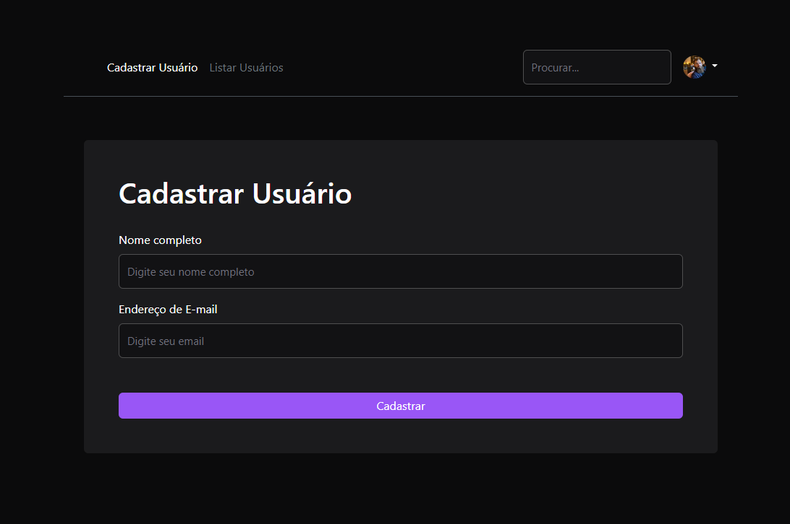

# Projeto CRUD com Tecnologias Modernas 🚀

## Descrição
Desenvolvi um projeto CRUD utilizando uma stack robusta de tecnologias, focando na eficiência e experiência do usuário. Este projeto se destaca pela eficiência, design responsivo, manutenibilidade e segurança.




## Tecnologias Utilizadas
- **Handlebars:** Motor de template para páginas dinâmicas.
- **Bootstrap:** Design responsivo e moderno.
- **Node.js:** Backend eficiente.
- **Express:** Gerenciamento de rotas e API RESTful.
- **Sequelize:** ORM para interação com MySQL.
- **MySQL:** Banco de dados relacional.

## Funcionalidades
- **Criar:** Adicione novos registros ao banco de dados.
- **Ler:** Consulte e visualize dados existentes.
- **Atualizar:** Edite informações já cadastradas.
- **Deletar:** Remova registros do sistema.

## Destaques do Projeto
- **Eficiência:** Alta performance e escalabilidade. ⚡
- **Design Responsivo:** Interface amigável em todos os dispositivos. 📱💻
- **Manutenibilidade:** Código limpo e organizado. 🛠️
- **Segurança:** Boas práticas de proteção de dados. 🔒

## Instalação e Execução

### Pré-requisitos
- Node.js
- npm start
- [XAMPP](https://www.apachefriends.org/index.html) (para executar o banco de dados MySQL)

### Passo a Passo

1. **Clone o repositório:**
   ```bash
   git clone https://github.com/seu-usuario/seu-repositorio.git
